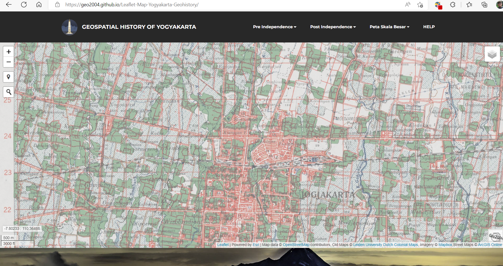

# Yogyakarta Geohistory

This repo is my personal project which has purpose to collect and share about collection of old and modern topographic maps ever produced for my hometown Yogyakarta City Indonesia. 

You can view all the collected data from this link : https://geo2004.github.io/Leaflet-Map-Yogyakarta-Geohistory

New data will be added once I find them from public data sources. 

Right now I also working on Historical Aerial/Satellite Imagery/Photographs data collection for Yogyakarta City in this repo: https://github.com/geo2004/Yogyakarta_Historical_Aerial_Satellite_Imagery_Photographs_Collection

## Preview:

